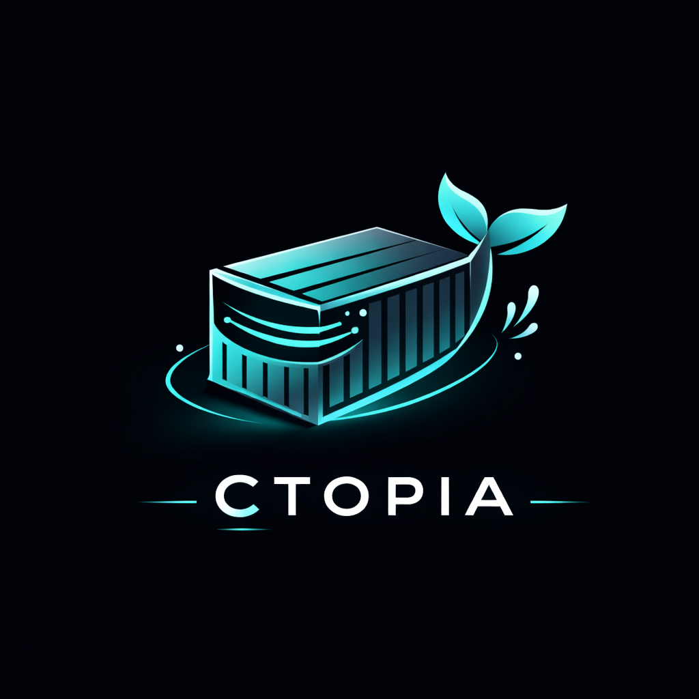
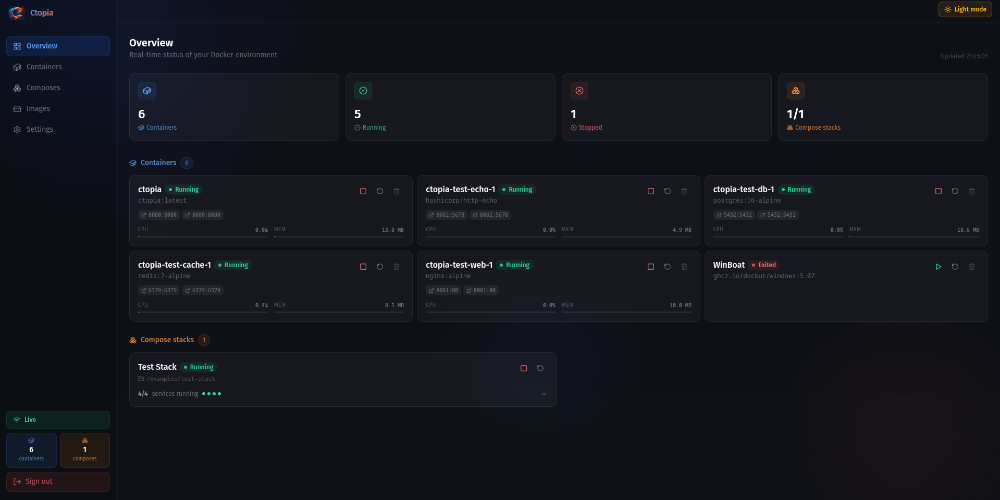
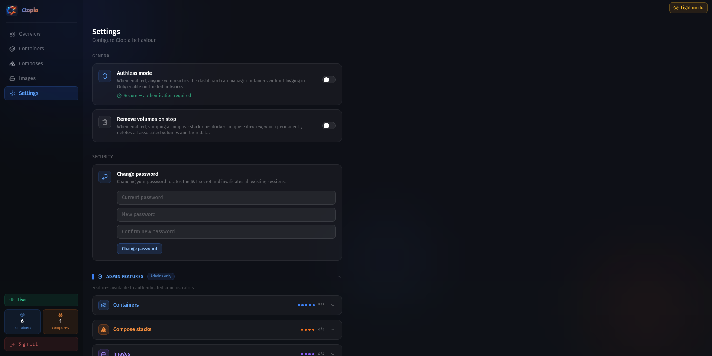

<div align="center">
  

  <h1>Ctopia</h1>

  <p>Lightweight, self-hosted Docker dashboard.</p>

  <p>
    <a href="https://github.com/Altagen/Ctopia/actions/workflows/ci.yml"></a>
    <a href="https://github.com/Altagen/Ctopia/releases/latest"></a>
    <a href="https://ghcr.io/altagen/ctopia"></a>
    <a href="LICENSE"></a>
  </p>
</div>

Manage containers, compose stacks, and images from a clean web UI — with real-time updates via WebSocket, granular feature flags, and optional authentication.

---

## Screenshots





---

## Features

- **Real-time monitoring** — container state, CPU & memory pushed via WebSocket every 3 s
- **Container management** — start, stop, restart, delete
- **Compose stacks** — manage multi-service stacks declared in `config.yml`
- **Image management** — list, delete, prune unused, pull by reference
- **Granular permissions** — per-action feature flags for admins and public (authless) users
- **Authless mode** — expose a read-only (or custom) view without requiring login
- **Single binary** — Go backend with embedded React frontend, no runtime dependencies

## Tech Stack

- **Backend**: Go 1.24 (with embedded frontend via `go:embed`)
- **Frontend**: React 18, TypeScript, Vite, Tailwind CSS v3
- **HTTP Router**: go-chi/chi v5
- **WebSocket**: Gorilla WebSocket
- **Auth**: JWT (30-day tokens) + bcrypt
- **Docker**: Docker SDK v28
- **Database**: SQLite
- **Build System**: Task (go-task)

## Platform Support

| Platform | Binary | Docker |
|----------|--------|--------|
| Linux x86_64 | ✅ | ✅ |
| Linux ARM64 | ✅ | ✅ |
| macOS Intel | ✅ | — |
| macOS Apple Silicon | ✅ | — |
| Windows | ❌ | — |

---

## Quick Start

### Docker (recommended)

```bash
# 1. Copy and edit the config
cp config.example.yml config.yml

# 2. Find your docker group id
DOCKER_GID=$(stat -c '%g' /var/run/docker.sock)

# 3. Run
docker run -d \
  --name ctopia \
  -p 8080:8080 \
  -v /var/run/docker.sock:/var/run/docker.sock \
  -v $(pwd)/config.yml:/app/config.yml:ro \
  -v ctopia-data:/app/data \
  --group-add $DOCKER_GID \
  ghcr.io/altagen/ctopia:latest
```

Or with Docker Compose:

```bash
cp config.example.yml config.yml
DOCKER_GID=$(stat -c '%g' /var/run/docker.sock) docker compose up -d
```

Open **http://localhost:8080** — you'll be guided through first-time setup.

### Build from source

**Prerequisites:** Go 1.24+, Node.js 22+, [Task](https://taskfile.dev)

```bash
git clone https://github.com/Altagen/Ctopia
cd Ctopia
task install-web   # npm install
task build         # builds frontend + embeds into Go binary
./dist/ctopia
```

---

## Configuration

Ctopia reads `config.yml` from the working directory by default. Override with `CTOPIA_CONFIG`.

```yaml
engine: docker
socket: /var/run/docker.sock
port: 8080
data_dir: ./data

auth:
  enabled: true

composes:
  - name: "My App"
    path: /srv/myapp
```

See [docs/configuration.md](docs/configuration.md) for the full reference.

---

## Development

```bash
task install-web

# Terminal 1 — Go API with hot-reload (requires air)
task dev-api

# Terminal 2 — Vite dev server (proxies /api and /ws to :8080)
task dev-web

# Or both at once
task dev
```

The Vite dev server runs on **http://localhost:5173**.

## Build

```bash
task build         # single binary
task docker        # build ctopia:latest Docker image
task docker-push   # build + push to ghcr.io
```

---

## Project Structure

```
ctopia/
├── cmd/hub/           # Binary entry point (main.go)
├── internal/
│   ├── api/           # HTTP server, routes, middleware, WebSocket
│   ├── auth/          # bcrypt password + JWT
│   ├── config/        # YAML config loading
│   ├── docker/        # Docker SDK wrapper
│   ├── models/        # Shared Go types
│   └── settings/      # Runtime settings
├── web/               # React 18 + TypeScript + Vite + Tailwind v3
│   └── src/
├── examples/
│   └── test-stack/    # Sample compose stack for local testing
├── docs/
├── Dockerfile
└── config.example.yml
```

## Documentation

- [Configuration](docs/configuration.md) — Full configuration reference
- [API](docs/api.md) — REST and WebSocket API reference
- [Compose Stacks](docs/compose-stacks.md) — Volume mounting guide
- [Roadmap](docs/roadmap.md) — Phase 1 status and Phase 2 backlog

---

## Contributing

Issues and bug reports are welcome on [GitHub](https://github.com/Altagen/Ctopia/issues).

## License

MIT License — see [LICENSE](LICENSE) for details.
